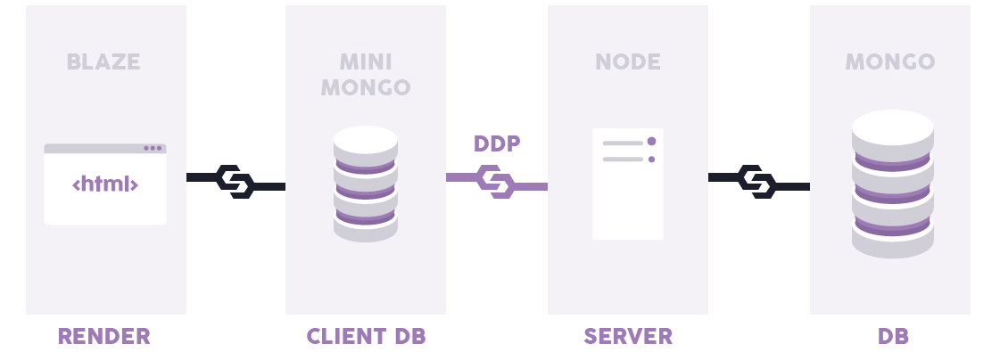

.. _tecnologia:

Tecnología
##########

Plataforma
==========

| El proyecto está desarrollado en JavaScritp utilizando *Meteor* como plataforma.
| La arquitectura de Meteor cuenta con 2 capas:

  1. **Frontend (Blaze - Mini Mongo)**
  2. **Backend (Node - MongoDB)**

| Para más información consultar la documentación oficial:

  - `Meteor <https://docs.meteor.com/>`_
  - `Blaze <http://blazejs.org/>`_
  - `MongoDB <https://docs.mongodb.com/>`_

HTML y CSS
==========

| El proyecto utiliza `Poncho <https://argob.github.io/poncho/>`_ la librería de estilos y componentes oficiales para diseñar y
| desarrollar sitios web y aplicaciones móviles del Gobierno de la República Argentina.

Herramientas
============

| Algunas de las librerías / herramientas utilizadas en el proyecto son:

  - `IronRouter <http://iron-meteor.github.io/iron-router/>`_ para el manejo de rutas y flujos.
  - `MomentJs <https://momentjs.com/docs/>`_ para el manejo de fechas y horas.
  - `UnderscoreJs <https://underscorejs.org/>`_ para simplificar procesos de desarrollo.
  - `Sentry <https://docs.sentry.io//>`_ para realizar tracking de errores.
